# SAM 系統規格書 — Sales Assistant Management

> 版本：v1.0 · 2026-07-28

---

## 目錄

1. [系統概觀](#1-系統概觀)
2. [系統架構](#2-系統架構)
3. [前端規格](#3-前端規格)
4. [後端微服務](#4-後端微服務)
5. [USB 實體保險箱](#5-usb-實體保險箱)
6. [資料庫 Schema](#6-資料庫-schema)
7. [API 規格](#7-api-規格)
8. [商業模式](#8-商業模式)
9. [非功能性需求](#9-非功能性需求)

---

## 1. 系統概觀

### 1.1 產品定位

SAM（Sales Assistant Management）是一套以 **LINE 為核心介面**、結合 **台灣在地 MoE 智能路由** 與 **USB 實體資安保險箱** 的混合雲 AI 銷售助理管理系統。

### 1.2 目標客群

| 客層 | 痛點 | SAM 解法 |
|------|------|----------|
| 個人業務（房仲、保險、直銷） | 客戶管理零散、回覆費時、群發像罐頭 | AI 接管 LINE 對話 + CRM 積分 + 個人化排程群發 |
| 微型電商、團購主 | 24H 客服成本高、錯單率高 | LINE 自動接單 + 商品 RAG 知識庫 |
| 中小企業（醫美、車商、診所） | 業務離職帶走客戶、團隊業績看不見 | SAM 企業 Dashboard + 團隊管理 + 客戶地圖 |

### 1.3 核心價值

- **資料自主**：私鑰與客戶資料 100% 存在 USB 保險箱，雲端零留存
- **成本套利**：台灣 MoE 分流，80% 常規對話走低成本 Token 管道
- **零摩擦**：LINE 掃碼即用，USB 插上即啟動，無需設定 API Key

### 1.4 系統整體架構圖

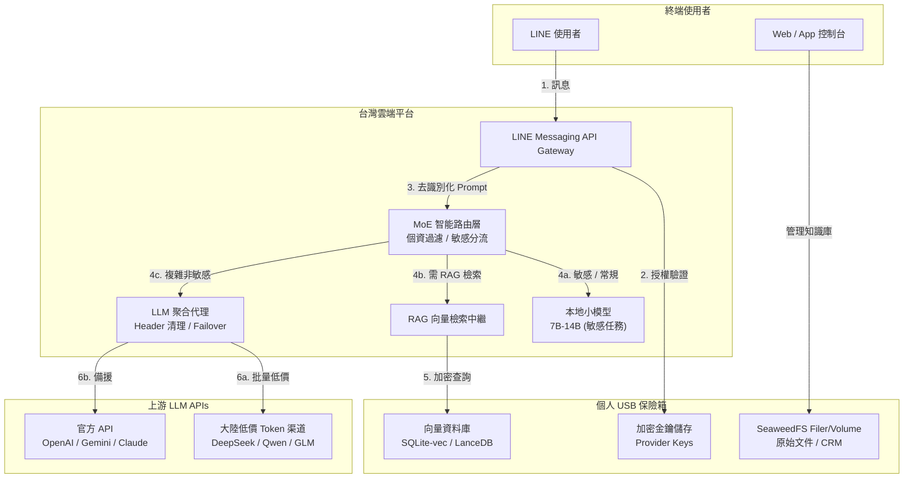

---

## 2. 系統架構

### 2.1 雲地分工原則

```
┌─────────────────────────────────────┐  ┌─────────────────────────────────────┐
│  雲端平台 (Cloud Platform)          │  │  地端 USB (Personal Hardware Vault) │
│  僅作為純粹算力與通訊通道           │  │  大腦靈魂與資安保險箱               │
├─────────────────────────────────────┤  ├─────────────────────────────────────┤
│  • LINE 訊息收發 (Messaging API)    │  │  • 所有私密金鑰 (Provider Keys)     │
│  • OCR 影像辨識 (僅 RAM 處理)       │  │  • SeaweedFS 本地資料庫             │
│  • 台灣 MoE 門衛 (敏感過濾)          │  │  • 客戶 CRM 積分 / 熱度紀錄         │
│  • 模型代理轉發與回應後處理          │  │  • 個人化 Prompt / 對話風格          │
│  • 加密隧道建立與維護               │  │  • 排程群發 Queue                   │
└─────────────────────────────────────┘  └─────────────────────────────────────┘
```

### 2.2 資料流架構

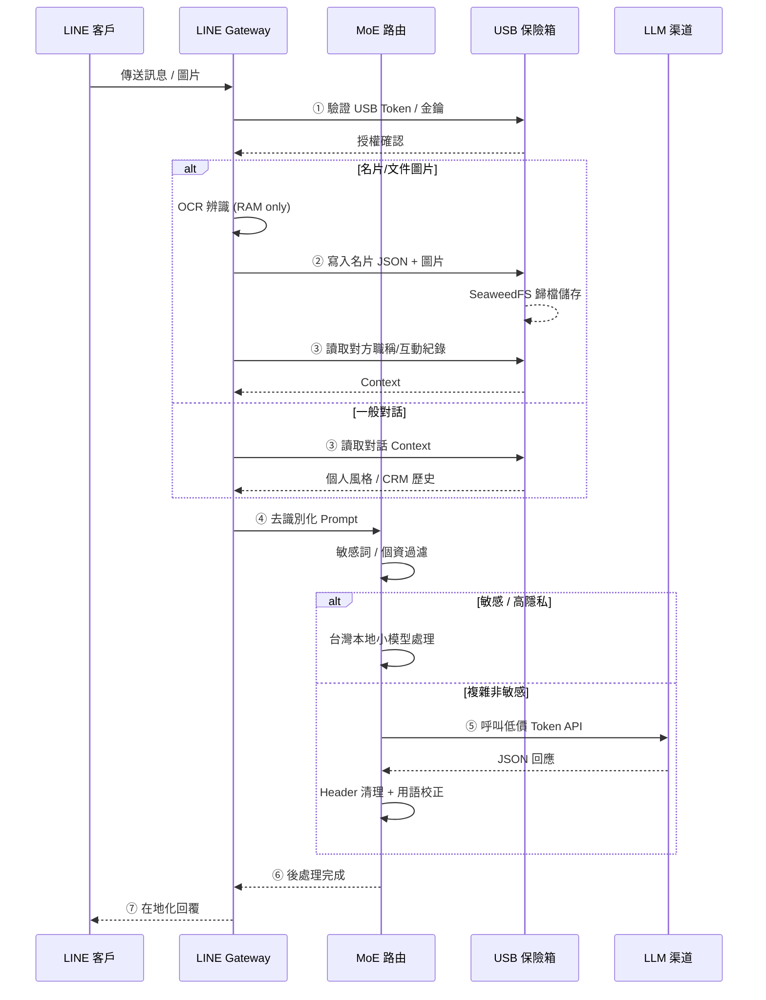

### 2.3 MoE 智能路由分流流程

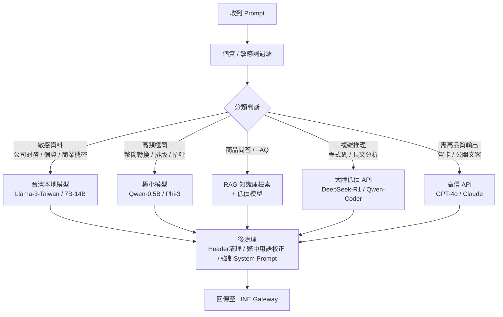

### 2.4 部署拓撲

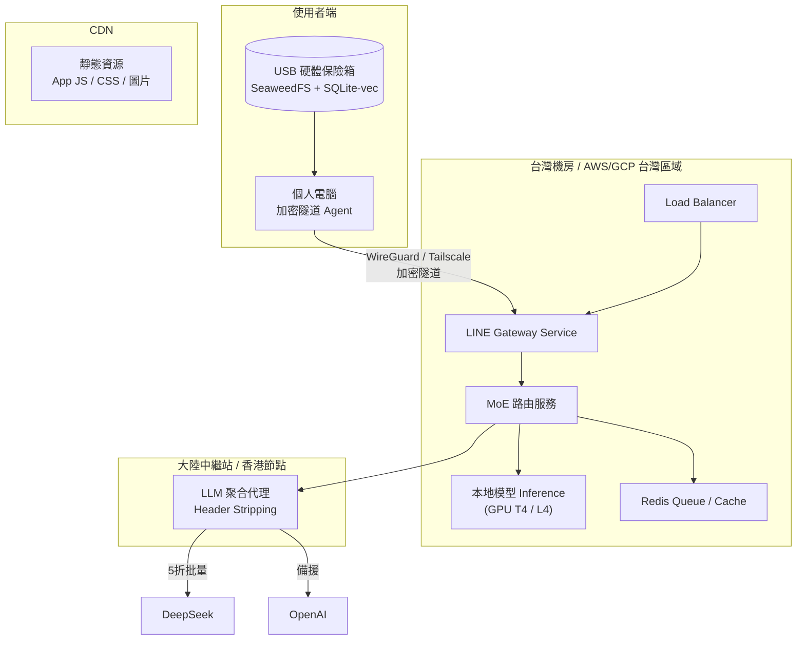

---

## 3. 前端規格

### 3.1 手機端 App（SAM Mobile）

#### 3.1.1 主頁面結構

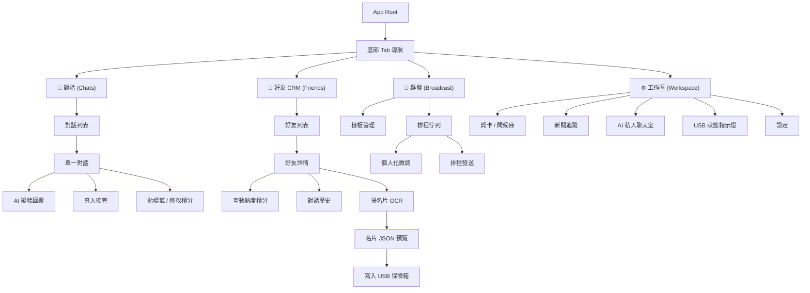

#### 3.1.2 關鍵 UI 元件

| 元件 | 描述 |
|------|------|
| **USB 狀態列** | 頂部常駐欄位，顯示「🟢 USB 已連接（地端模式）」或「🔴 USB 已拔除！物理斷連保護中」 |
| **好友積分徽章** | 好友頭像旁顯示 🔥 N 表示互動熱度，顏色依分數變化 |
| **AI 擬稿氣泡** | 對話中 AI 自動產生的回覆草稿，使用者可「確認發送｜修改｜忽略」 |
| **排程佇列進度** | 顯示「已排程 47 封 · 預計 2.5 小時完成 · 隨機間隔 3-7 分鐘」 |

### 3.2 企業 Dashboard（SAM Enterprise）

| 模組 | 功能 |
|------|------|
| **戰情室** | 團隊互動熱度總覽、AI 銷售績效預測、本月預估營收 |
| **客戶地圖** | 名片地址自動標註熱力圖、周邊高意向沉睡客戶提示 |
| **團隊管理** | 業務員權限控管、客戶資產歸屬、離職無縫接管 |
| **資安設定** | 企業級敏感詞過濾規則、資料出境稽核日誌 |
| **Token 用量** | 團隊 Token 消耗儀表板、預算上限警報 |

---

## 4. 後端微服務

### 4.1 服務清單

| 服務 | 職責 | 技術建議 |
|------|------|----------|
| `line-gateway` | LINE Messaging API Webhook 收發、簽章驗證、狀態管理 | Node.js / FastAPI |
| `moe-router` | MoE 智能路由：敏感過濾、模型分流、後處理 | Python + ONNX |
| `ocr-worker` | 名片/文件 OCR 辨識、結構化 JSON 生成 | Python + PaddleOCR / Gemini Vision |
| `llm-aggregator` | LLM API 聚合代理：Header 清理、Failover、Rate Limit | Go / Node.js |
| `tunnel-manager` | 加密隧道管理：WireGuard / Tailscale 節點狀態 | Go |
| `crm-service` | 好友 CRM 積分計算、標籤管理、互動分析 | Node.js + PostgreSQL |
| `broadcast-queue` | 排程群發佇列管理、隨機間隔發送 | Redis Bull / Celery |
| `auth-service` | USB 金鑰驗證、JWT 簽發、設備綁定 | Node.js |

### 4.2 MoE 路由引擎規格

```
Input:  { prompt, user_id, message_type, sensitivity_hint? }
                 │
                 ▼
    ┌─────────────────────────────────────┐
    │  Step 1: PII Anonymization          │
    │  • 正則匹配電話/email/地址 → 遮罩   │
    │  • 自訂敏感詞辭典匹配               │
    └─────────────────────────────────────┘
                 │
                 ▼
    ┌─────────────────────────────────────┐
    │  Step 2: 任務分類 (Classifier)       │
    │  • 輕量模型判斷任務類型             │
    │  • 輸出 routing_decision            │
    └─────────────────────────────────────┘
                 │
                 ▼
    ┌─────────────────────────────────────┐
    │  Step 3: 模型派發                   │
    │  • 對照 routing table 選擇目標      │
    │  • 注入自定義 System Prompt         │
    └─────────────────────────────────────┘
                 │
                 ▼
    ┌─────────────────────────────────────┐
    │  Step 4: 回應後處理                 │
    │  • 清除上游 API Header (Trace ID)   │
    │  • 繁中用語校正 (服務器→伺服器)     │
    │  • 強制覆蓋 model 欄位名稱           │
    └─────────────────────────────────────┘
                 │
                 ▼
Output: { clean_response, model_used(內部), latency_ms }
```

### 4.3 LLM 聚合代理規格

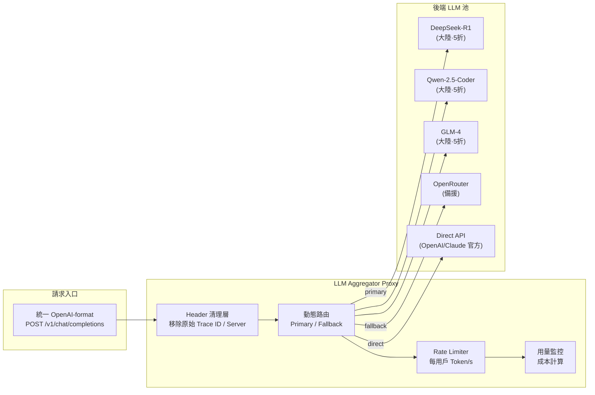

---

## 5. USB 實體保險箱

### 5.1 硬體規格

| 項目 | 規格 |
|------|------|
| 容量 | 64GB / 128GB USB 3.0 |
| 加密 | AES-256 硬體加密磁區 |
| 金鑰儲存 | 獨立 Secure Element 晶片（可選） |
| 預載軟體 | SeaweedFS Volume Node + SQLite-vec + Tunnel Agent |

### 5.2 軟體架構

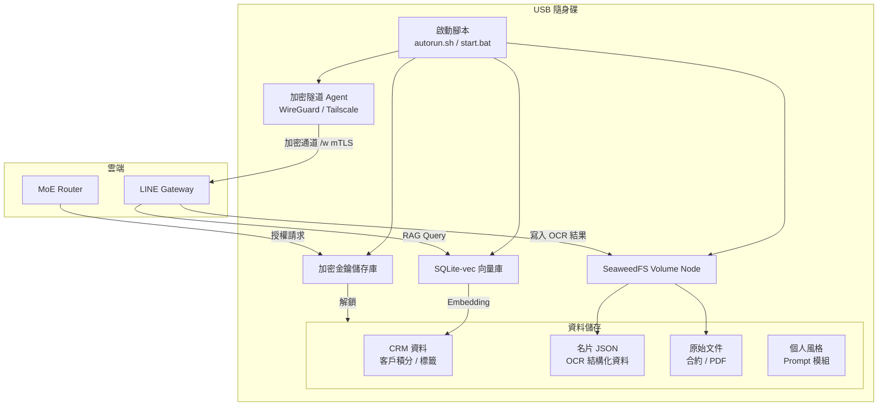

### 5.3 安全模型

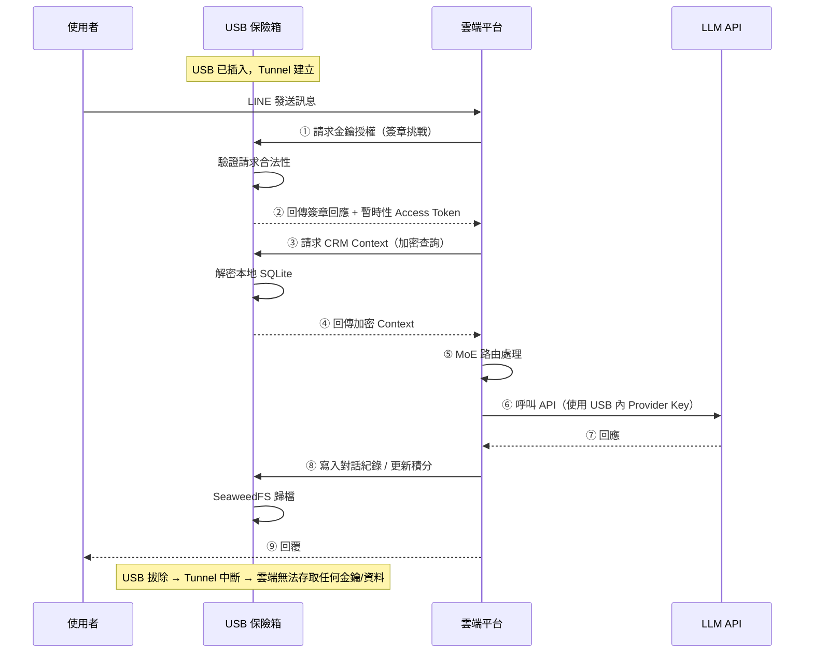

### 5.4 備份與災難復原

| 情境 | 機制 |
|------|------|
| USB 遺失 | 主密碼短語（BIP39 級別）還原至新 USB |
| USB 損毀 | 加密備份至雲端（金鑰僅存 USB），新 USB 輸入主密碼解密 |
| 雲端服務中斷 | USB 內本地 Queue 暫存訊息，連線恢復後同步 |

---

## 6. 資料庫 Schema

### 6.1 核心資料表（USB 本地 SQLite）

#### `contacts` — 好友 / 客戶資料

```sql
CREATE TABLE contacts (
    id            TEXT PRIMARY KEY,              -- UUID
    line_user_id  TEXT UNIQUE NOT NULL,          -- LINE User ID
    display_name  TEXT NOT NULL,                 -- LINE 顯示名稱
    nickname      TEXT,                          -- 自訂暱稱
    title         TEXT,                          -- 職稱 (OCR 填入)
    company       TEXT,                          -- 公司 (OCR 填入)
    phone         TEXT,                          -- 電話 (OCR 填入)
    email         TEXT,                          -- Email (OCR 填入)
    tags          TEXT DEFAULT '[]',             -- JSON 標籤陣列
    engagement_score INTEGER DEFAULT 0,          -- 互動熱度積分
    last_interact_at DATETIME,                  -- 最後互動時間
    created_at    DATETIME DEFAULT CURRENT_TIMESTAMP,
    updated_at    DATETIME DEFAULT CURRENT_TIMESTAMP
);

CREATE INDEX idx_contacts_score ON contacts(engagement_score DESC);
CREATE INDEX idx_contacts_tags ON contacts(tags);
```

#### `cards` — 名片掃描記錄

```sql
CREATE TABLE cards (
    id            TEXT PRIMARY KEY,              -- UUID
    contact_id    TEXT REFERENCES contacts(id),
    raw_image_url TEXT,                          -- 原始圖片 (SeaweedFS key)
    ocr_raw       TEXT,                          -- OCR 原始辨識文字
    ocr_json      TEXT NOT NULL,                 -- 結構化 JSON
    status        TEXT DEFAULT 'pending',        -- pending / confirmed / rejected
    created_at    DATETIME DEFAULT CURRENT_TIMESTAMP
);

CREATE INDEX idx_cards_contact ON cards(contact_id);
```

#### `messages` — 對話歷史

```sql
CREATE TABLE messages (
    id            TEXT PRIMARY KEY,
    contact_id    TEXT REFERENCES contacts(id),
    direction     TEXT NOT NULL,                 -- inbound / outbound
    content       TEXT NOT NULL,
    content_type  TEXT DEFAULT 'text',           -- text / image / flex
    ai_generated  BOOLEAN DEFAULT FALSE,         -- 是否 AI 代回
    ai_approved   BOOLEAN,                      -- 是否經真人確認
    token_cost    INTEGER DEFAULT 0,             -- 消耗 Token 數
    created_at    DATETIME DEFAULT CURRENT_TIMESTAMP
);

CREATE INDEX idx_messages_contact ON messages(contact_id);
CREATE INDEX idx_messages_time ON messages(created_at);
```

#### `broadcast_tasks` — 排程群發

```sql
CREATE TABLE broadcast_tasks (
    id            TEXT PRIMARY KEY,
    name          TEXT NOT NULL,                 -- 任務名稱
    template_id   TEXT,                          -- 使用的樣板 ID
    status        TEXT DEFAULT 'draft',          -- draft / queued / sending / done / cancelled
    total_count   INTEGER DEFAULT 0,
    sent_count    INTEGER DEFAULT 0,
    scheduled_at  DATETIME,
    completed_at  DATETIME,
    created_at    DATETIME DEFAULT CURRENT_TIMESTAMP
);

CREATE TABLE broadcast_items (
    id            TEXT PRIMARY KEY,
    task_id       TEXT REFERENCES broadcast_tasks(id),
    contact_id    TEXT REFERENCES contacts(id),
    personalized_content TEXT,                   -- 個人化後的內容
    status        TEXT DEFAULT 'pending',        -- pending / sent / failed
    sent_at       DATETIME,
    error_reason  TEXT
);

CREATE INDEX idx_broadcast_task ON broadcast_items(task_id);
CREATE INDEX idx_broadcast_status ON broadcast_items(status);
```

#### `persona_settings` — 個人風格設定

```sql
CREATE TABLE persona_settings (
    id            TEXT PRIMARY KEY,
    user_id       TEXT UNIQUE NOT NULL,
    style_prompt  TEXT,                          -- 語氣風格描述
    greeting_template TEXT,                      -- 預設問候樣板
    signature     TEXT,                          -- 簽名檔
    custom_rules  TEXT DEFAULT '[]',             -- 自訂規則 JSON
    created_at    DATETIME DEFAULT CURRENT_TIMESTAMP,
    updated_at    DATETIME DEFAULT CURRENT_TIMESTAMP
);
```

### 6.2 雲端暫存區（Redis）

| Key Pattern | Value | TTL | 用途 |
|------------|-------|-----|------|
| `session:{userId}` | `{ state, context }` | 30min | 對話狀態機 |
| `queue:{userId}:broadcast` | `[items]` | 24h | 排程佇列 |
| `ratelimit:{userId}:{model}` | `{ count, window }` | 1min | Rate Limit |
| `tunnel:{deviceId}` | `{ endpoint, status }` | — | 加密隧道狀態 |

---

## 7. API 規格

### 7.1 RESTful API 端點

#### LINE Gateway

| Method | Path | 描述 |
|--------|------|------|
| `POST` | `/api/v1/webhook/line` | LINE Webhook 接收 |
| `GET` | `/api/v1/channel/:id/status` | Channel 連線狀態 |

#### 好友 CRM

| Method | Path | 描述 |
|--------|------|------|
| `GET` | `/api/v1/contacts` | 好友列表（可篩選標籤/積分） |
| `GET` | `/api/v1/contacts/:id` | 好友詳情 |
| `PATCH` | `/api/v1/contacts/:id` | 更新好友資料 / 積分 |
| `DELETE` | `/api/v1/contacts/:id` | 刪除好友 |
| `POST` | `/api/v1/contacts/:id/tags` | 新增標籤 |
| `DELETE` | `/api/v1/contacts/:id/tags/:tag` | 移除標籤 |

#### 名片 OCR

| Method | Path | 描述 |
|--------|------|------|
| `POST` | `/api/v1/cards/scan` | 上傳圖片 → OCR 辨識 |
| `GET` | `/api/v1/cards` | 名片歷史列表 |
| `GET` | `/api/v1/cards/:id` | 名片詳情 |
| `POST` | `/api/v1/cards/:id/confirm` | 確認寫入 USB |
| `POST` | `/api/v1/cards/:id/reject` | 拒絕並刪除暫存 |

#### 排程群發

| Method | Path | 描述 |
|--------|------|------|
| `POST` | `/api/v1/broadcast` | 建立群發任務 |
| `GET` | `/api/v1/broadcast` | 任務列表 |
| `GET` | `/api/v1/broadcast/:id` | 任務進度 |
| `POST` | `/api/v1/broadcast/:id/start` | 啟動發送 |
| `POST` | `/api/v1/broadcast/:id/cancel` | 取消任務 |

#### 賀卡 / 問候

| Method | Path | 描述 |
|--------|------|------|
| `GET` | `/api/v1/greetings/templates` | 賀卡樣板列表 |
| `POST` | `/api/v1/greetings/generate` | 針對指定好友生成賀卡 |
| `POST` | `/api/v1/greetings/send` | 直接發送賀卡 |

#### USB 金鑰驗證

| Method | Path | 描述 |
|--------|------|------|
| `POST` | `/api/v1/usb/challenge` | 發起金鑰驗證挑戰 |
| `POST` | `/api/v1/usb/verify` | 驗證簽章回應 |
| `GET` | `/api/v1/usb/status` | USB 連線狀態 |
| `POST` | `/api/v1/usb/backup/restore` | 從加密備份還原 |

### 7.2 LINE Webhook 事件處理流程

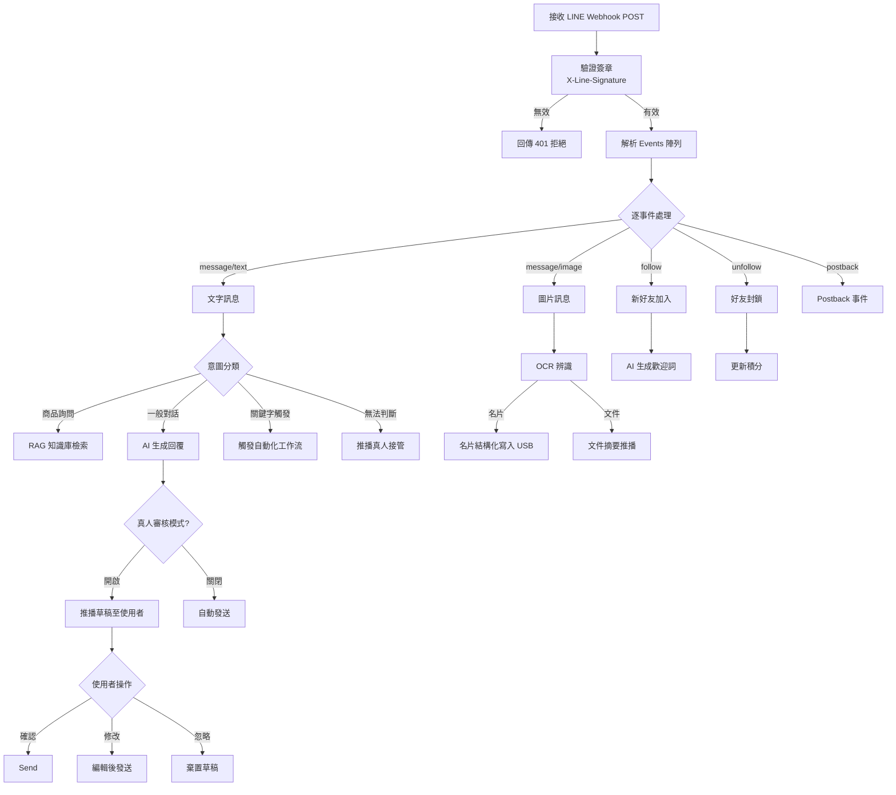

---

## 8. 商業模式

### 8.1 產品定價矩陣

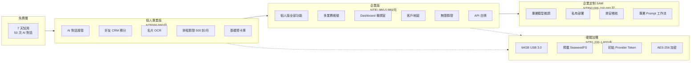

### 8.2 Token 點數包

| 方案 | 價格 | 約當 Token 量 | 毛利率 |
|------|------|---------------|--------|
| 體驗包 | 隨 USB 贈送 | $1-2 USD 等值 | — |
| 輕量包 | NT$ 300 | ~500 萬 Token | ~50% |
| 標準包 | NT$ 1,000 | ~1,800 萬 Token | ~60% |
| 企業包 | NT$ 3,000 | ~6,000 萬 Token | ~70% |

### 8.3 獲利閉環

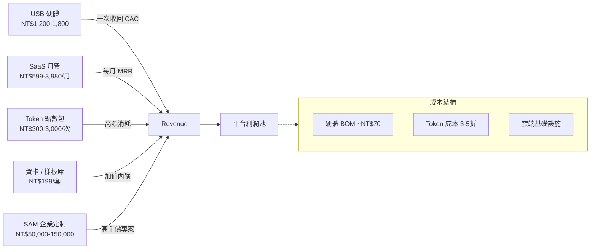

---

## 9. 非功能性需求

### 9.1 效能目標

| 指標 | 目標 |
|------|------|
| TTFT（首字延遲） | 在地模型 < 200ms / 大陸 API < 1.5s |
| OCR 辨識 | 名片 < 3s / A4 文件 < 5s |
| 排程群發吞吐 | 每分鐘 > 60 封（隨機間隔） |
| USB 金鑰驗證 | < 100ms |
| 並發連線 | 單節點 > 1,000 Webhook 同時 |

### 9.2 安全標準

| 項目 | 要求 |
|------|------|
| 傳輸加密 | TLS 1.3 / mTLS（雲地隧道） |
| USB 儲存 | AES-256 硬體加密磁區 |
| API 金鑰 | 永不儲存於雲端，僅 USB 內 Secure Element |
| LINE 簽章 | 全端點驗證 X-Line-Signature |
| 日誌 | 雲端僅保留去識別化操作日誌，原始資料零留存 |

### 9.3 技術棧建議

| 層級 | 技術 |
|------|------|
| 前端 Mobile | React Native / Flutter |
| 前端 Dashboard | React + Tailwind + Recharts |
| 後端 API | Node.js (Fastify) / Go (Fiber) |
| MoE 路由 | Python + FastAPI + ONNX Runtime |
| 資料庫（雲） | PostgreSQL + Redis |
| 資料庫（USB） | SQLite + SQLite-vec + SeaweedFS |
| 加密隧道 | WireGuard / Tailscale |
| 雲端部署 | AWS 台灣區域 / GCP asia-east1 |
| CDN | Cloudflare |
| LLM 代理 | 自建 Go Reverse Proxy |

### 9.4 開發優先順序

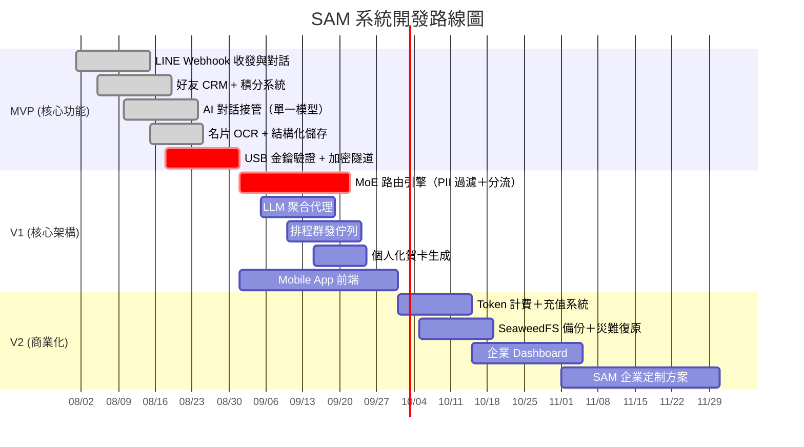

---

> 本規格書對應系統代號 **SAM** (Sales Assistant Management)  
> 基於 Hybrid MoE Cloud + USB Hardware Vault 架構  
> 文件維護：`docs/SAM_System_Specification.md`
