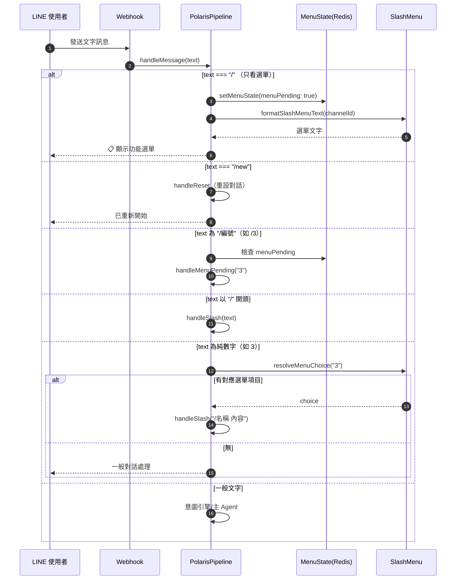
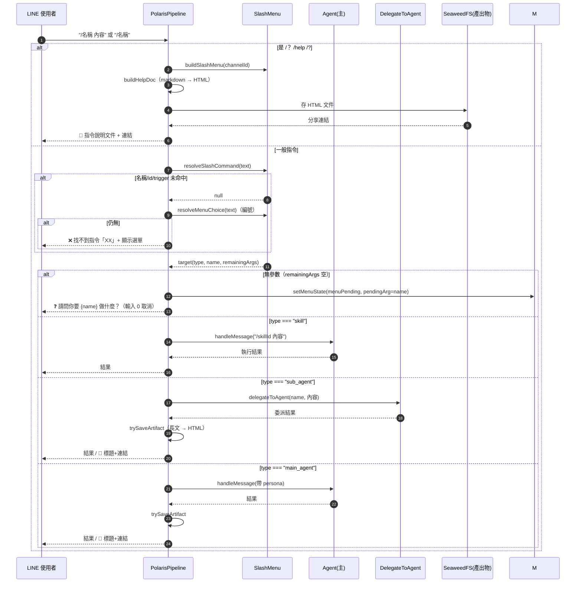
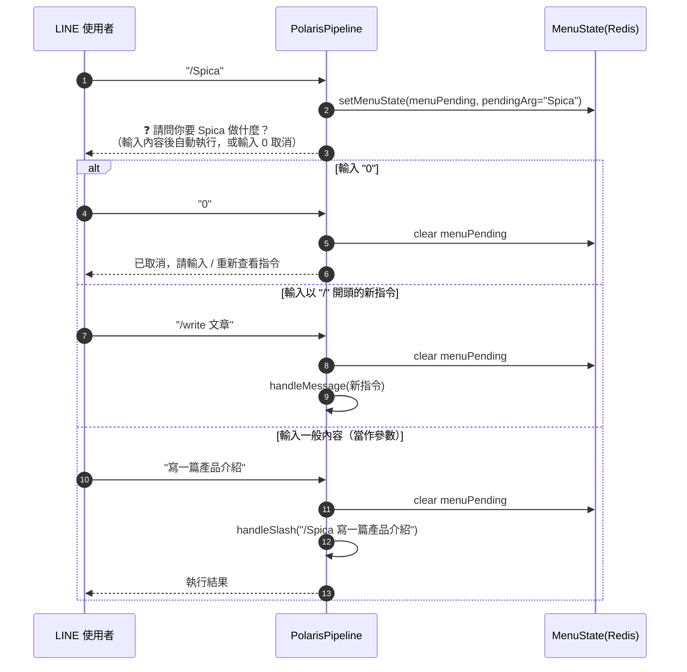
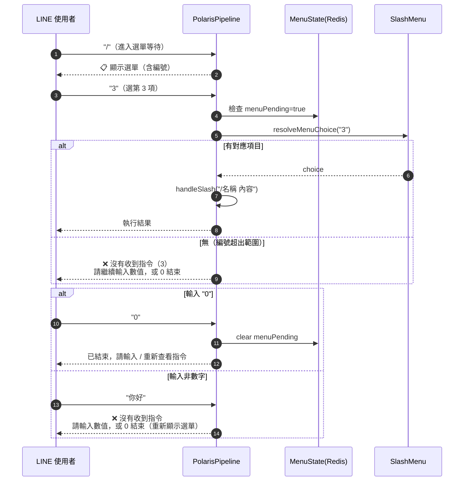
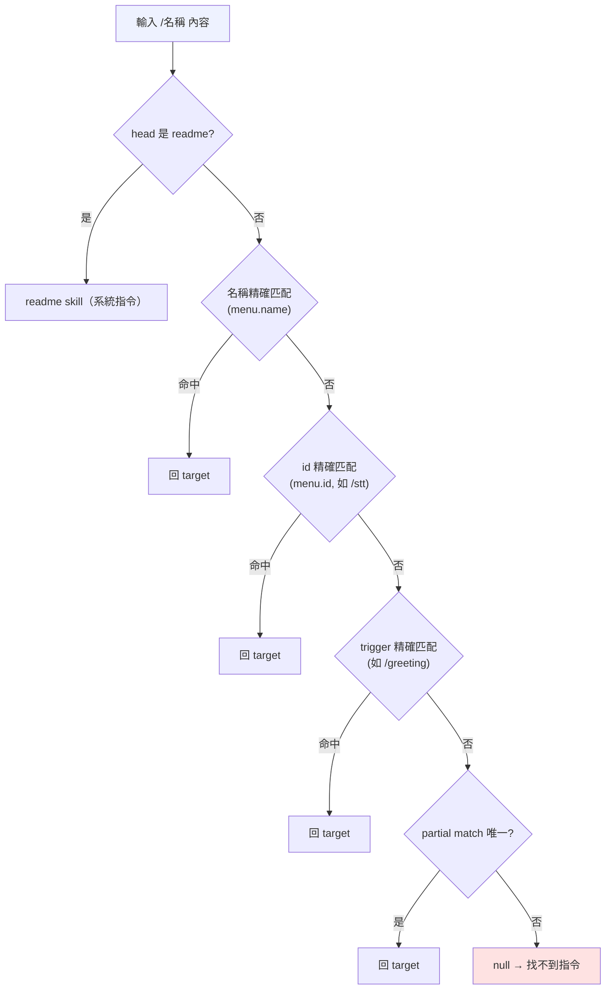
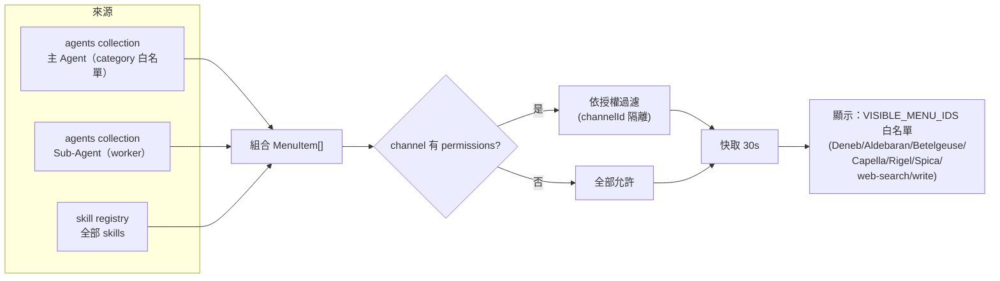
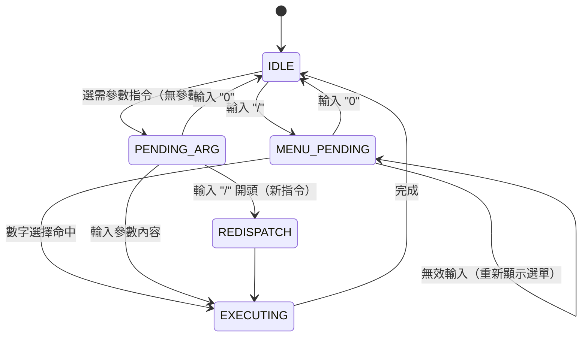

# 斜線指令（/）操作互動規格

> 最後更新：2026-08-04
> 相關實作：`server/src/agent/pipeline.ts`（handleSlash / handleMenuPending）、`server/src/agent/slashMenu.ts`（resolveSlashCommand / buildSlashMenu）
> 互動圖：Mermaid sequence diagram

---

## 1. 總覽

`/` 是**多輪對話**的指令系統：使用者可用「斜線指令」（`/名稱 內容`）或「編號」（`1`、`/3`）呼叫
主 Agent / Sub-Agent / Skill。需要參數但未提供時，進入 pendingArg 狀態提問，等使用者輸入後自動執行。

```
呼叫對象分類：
  主 Agent   → category: orchestrator/planner/reviewer/memory/consultant（自動決策）
  Sub-Agent → category: worker（執行單一任務）
  Skill     → skill registry（process/script/inline executor）
```

---

## 2. 入口分派（handleMessage）



---

## 3. handleSlash 核心流程



---

## 4. 多輪互動：等待參數（pendingArg）

使用者選了需參數的指令（如 `/Spica 主題`）但未給參數 → 進入等待狀態：



---

## 5. 多輪互動：等待數字選擇（menuPending）

使用者輸入 `/` 後處於選單等待狀態，此時輸入的數字代表選單項目：



---

## 6. 解析優先序（resolveSlashCommand）



---

## 7. 選單來源與權限（buildSlashMenu）



---

## 8. 狀態機（MenuState）



---

## 9. 互動重點整理

| 情境 | 使用者輸入 | 系統行為 |
|------|-----------|---------|
| 顯示選單 | `/` | 設 menuPending，顯示功能選單 |
| 說明文件 | `/？` `/help` `/？` | 產生 HTML 說明文件存 SeaweedFS，回標題+連結 |
| 直接執行 | `/名稱 內容` | resolveSlashCommand → 依 type 執行 |
| 需參數提問 | `/名稱`（無內容）| 設 pendingArg，問「請問你要 X 做什麼？」 |
| 多輪補參數 | 輸入內容（pendingArg 中）| 自動補成 `/名稱 內容` 執行 |
| 編號選擇 | `1` `2` `/3` | resolveMenuChoice → handleSlash |
| 取消等待 | `0` | 清除 menuPending / pendingArg |
| 找不到指令 | `/未知` | 回「找不到指令」+ 重新顯示選單 |
